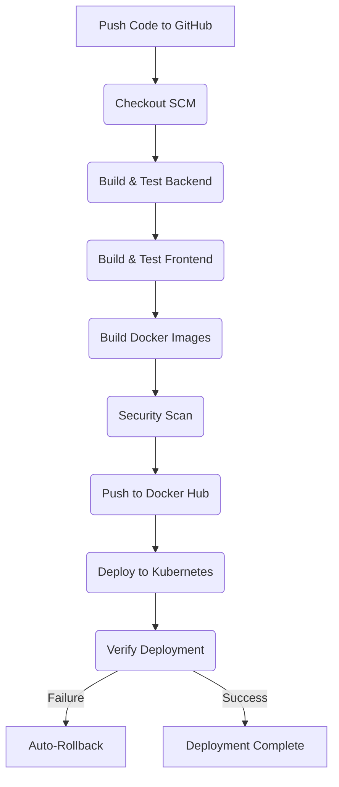

# Smart Event Management Portal - DevOps Pipeline

Welcome to the Smart Event Management Portal! This project is a complete showcase of a modern DevOps lifecycle, taking a multi-tier web application (React, Node.js, PostgreSQL) and wrapping it in a robust, cloud-native infrastructure using Docker, Kubernetes, and Jenkins.

---

## 📁 Project File Structure

Here is a detailed breakdown of the files and directories in this repository and what they do:

- **`frontend/`**: Contains the React + Vite frontend application.
  - `Dockerfile`: Instructions for building the optimized, production-ready Nginx container for the frontend.
  - `package.json`: Defines the frontend dependencies and scripts.
- **`backend/`**: Contains the Node.js Express REST API.
  - `Dockerfile`: Instructions for containerizing the backend API.
  - `prisma/`: Contains the database schema and migration tools.
- **`k8s/`**: Contains all Kubernetes YAML manifests for orchestration.
  - `frontend-deployment.yaml`: Defines how the frontend is scaled and deployed across the cluster, including liveness/readiness probes.
  - `backend-deployment.yaml`: Defines the backend deployment, including a database migration `initContainer`.
  - `db-deployment.yaml`: Provisions the PostgreSQL database pod.
  - `db-secret.yaml`: Securely stores the database credentials.
- **`Jenkinsfile`**: The heart of the CI/CD pipeline. A Groovy script that dictates every step Jenkins takes from checking out the code to deploying it to Kubernetes.
- **`docker-compose.yml`**: A configuration file used to spin up the entire application stack locally with a single command for development purposes.
- **`innovation-report.md`**: A detailed report on the advanced DevSecOps features (vulnerability scanning, automated DB migrations, advanced health probes) implemented for the Innovation Challenge.

---

## 🚀 The CI/CD Pipeline (Jenkins)

Our CI/CD pipeline is fully automated. Whenever new code is pushed to this repository, Jenkins detects the change and triggers the following workflow:



### Pipeline Stages Explained:
1. **Checkout SCM**: Jenkins connects to GitHub and pulls the latest source code.
2. **Build & Test**: Jenkins enters the `backend` and `frontend` directories, installs dependencies via `npm`, runs tests, and creates the optimized frontend build.
3. **Build Docker Images**: Jenkins reads the `Dockerfile` in each directory and packages the code into isolated Docker images.
4. **Security Scan (Innovation)**: A DevSecOps step that scans the newly built images for known vulnerabilities before they are released.
5. **Push to Docker Hub**: The verified images are uploaded to the public Docker Hub registry, tagged with the specific Jenkins Build Number (e.g., `v5`).
6. **Deploy to Kubernetes**: Jenkins dynamically updates the Kubernetes YAML files with the new version tag and applies them to the cluster.
7. **Verify & Rollback**: Jenkins monitors the Kubernetes rollout. If the new pods fail to start (e.g., crashing code), Jenkins immediately catches the error and issues a rollback command to restore the previous working version.

---

## 💻 Setup and Deployment Commands

Follow these steps to run the project yourself.

### 1. Local Development via Docker Compose
If you want to quickly test the application locally without Kubernetes, you can use Docker Compose. This will build the images and start the database, backend, and frontend connected together.

```bash
docker-compose up -d --build
```

To stop the application and clean up the containers, run the following:

```bash
docker-compose down
```

### 2. Kubernetes Deployment
If you are running a local Kubernetes cluster (like Docker Desktop or Minikube), you can deploy the application using the manifests in the `k8s/` folder.

First, apply the database credentials secret:

```bash
kubectl apply -f k8s/db-secret.yaml
```

Next, apply all the remaining deployments and services (frontend, backend, database):

```bash
kubectl apply -f k8s/
```

To verify that your pods are spinning up successfully, check their status:

```bash
kubectl get pods
```

To see the services and the ports they are running on (so you can access them in your browser):

```bash
kubectl get svc
```

### 3. CI/CD Automated Deployment
If you have Jenkins installed, you don't need to run the above Kubernetes commands manually. Instead, you can trigger the pipeline.

Ensure your `Jenkinsfile` is configured correctly, then inside Jenkins, click:

```text
Build Now
```

To watch the pipeline progress in real-time, click on the flashing build number and open the console output.
