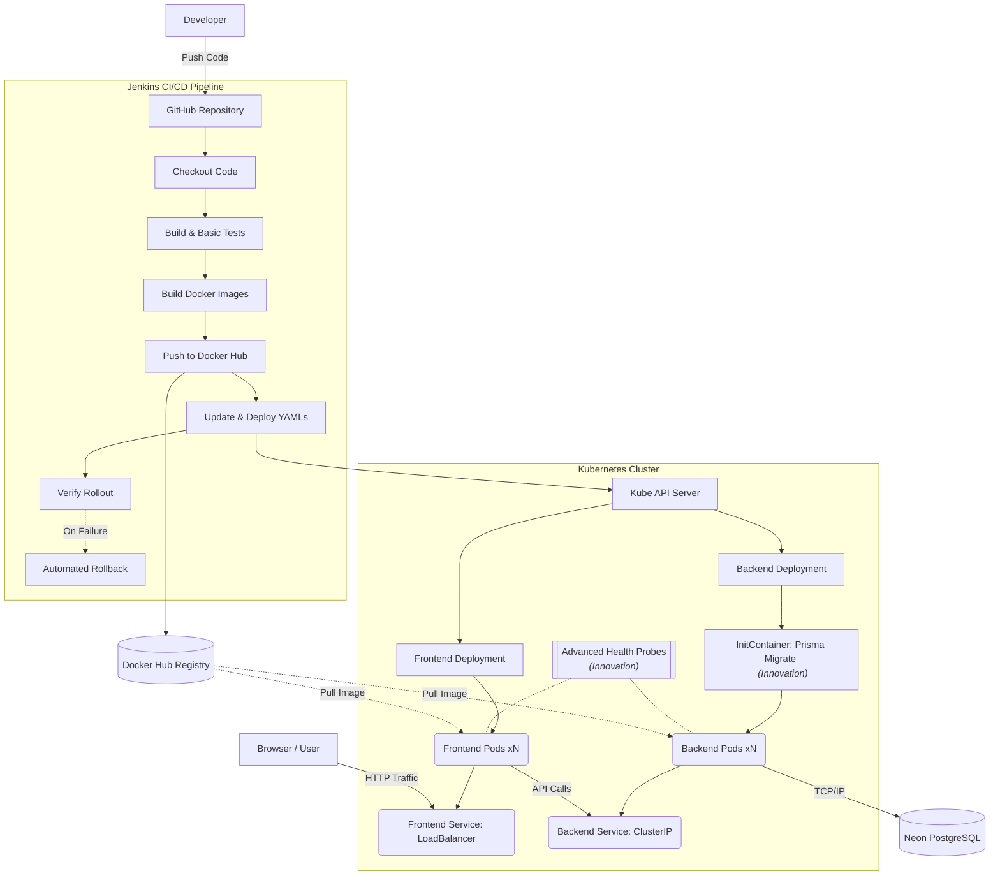

# DevOps Architecture & Flow

```mermaid
graph TD
    %% Developer Flow
    Developer[Developer] -->|Push Code| Github[GitHub Repository]
    
    %% CI/CD Pipeline
    subgraph Jenkins [Jenkins CI/CD Pipeline]
        Github --> Checkout[Checkout Code]
        Checkout --> BuildTest[Build & Basic Tests]
        BuildTest --> DockerBuild[Build Docker Images]
        DockerBuild --> DockerPush[Push to Docker Hub]
        DockerPush --> K8sDeploy[Update & Deploy YAMLs]
        K8sDeploy --> Verify[Verify Rollout]
        Verify -.->|On Failure| Rollback[Automated Rollback]
    end
    
    %% Docker Registry
    DockerPush --> DockerHub[(Docker Hub Registry)]
    
    %% Kubernetes Cluster
    subgraph Kubernetes [Kubernetes Cluster]
        K8sDeploy --> KubeApi[Kube API Server]
        
        KubeApi --> FrontendDeploy[Frontend Deployment]
        KubeApi --> BackendDeploy[Backend Deployment]
        
        BackendDeploy --> InitContainer["InitContainer: Prisma Migrate <br/> <i>(Innovation)</i>"]
        InitContainer --> BackendPods(Backend Pods xN)
        
        FrontendDeploy --> FrontendPods(Frontend Pods xN)
        
        FrontendPods --> FrontendSVC(Frontend Service: LoadBalancer)
        BackendPods --> BackendSVC(Backend Service: ClusterIP)
        
        %% Advanced Probes Innovation
        HealthProbes[["Advanced Health Probes <br/> <i>(Innovation)</i>"]] -.- BackendPods
        HealthProbes -.- FrontendPods
    end
    
    %% Traffic
    DockerHub -.->|Pull Image| FrontendPods
    DockerHub -.->|Pull Image| BackendPods
    
    Internet[Browser / User] -->|HTTP Traffic| FrontendSVC
    FrontendPods -->|API Calls| BackendSVC
    BackendPods -->|TCP/IP| Database[(Neon PostgreSQL)]
```
